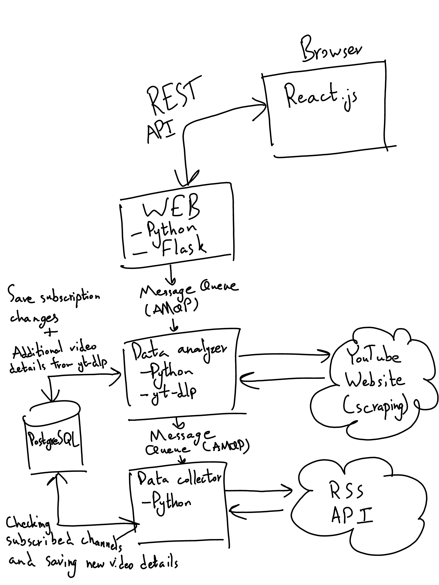
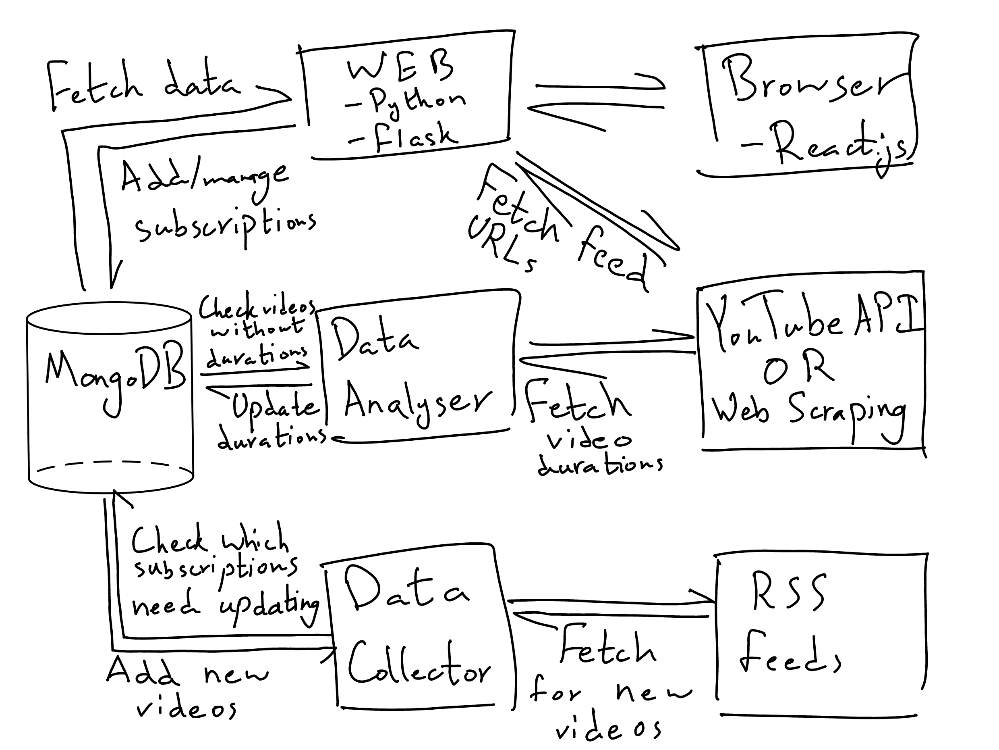

# YouTube Subscriber

This application runs continuously, optionally on a server, watching YouTube feeds
for new videos. This can be used to eliminate the need to subscribe to the channels
themselves or even create a Google account. It also allows you to follow YouTube
playlists.

## Technology Stack

### Back-end

- Language: Python.
- Web Framework Flask.
- [venv](https://docs.python.org/3/library/venv.html) for the virtual environment.
- Type checking using [mypy](https://www.mypy-lang.org/).
- Testing using [unittest](https://docs.python.org/3/library/unittest.html).
- Production on a Private VPS running Arch Linux.
- Production deployment using [gunicorn](https://flask.palletsprojects.com/en/stable/deploying/gunicorn/)
and [nginx](http://nginx.org/).

### Front-end

- Language: JavaScript.
- Built using [Vite](https://vite.dev/).
- Hosted on [GitHub Pages](https://pages.github.com/).

## Whiteboard

The following is the initial version of the whiteboard:

The data collector fetches the RSS feed of YouTube Channels/Playlists for new videos.
The original design had it storing the list of subscriptions to fetch in memory,
not updating it by re-querying the database but instead by getting instructions
from the data analyser. The only interactions with the database were getting the
subscriptions list at startup and saving new videos after each fetch.

The data analyser is the one that actually controls the subscription list by adding/deleting
them. It too keeps the list of subscriptions in memory, and periodically fetches
additional video details (duration) using [yt-dlp](https://github.com/yt-dlp/yt-dlp),
writing them to the database.

Finally we have the Flask app, which serves the data using an API. It also has the
functionality of modifying the subscriptions list, but not by itself as it has to
message the Data analyser through the message queue. This is because scraping YouTube
might be needed to convert channel URLs to feed links, for which the data analyser
is more suited.

However, as the development progressed, the whiteboard structure changed to the following:

There are many changes, which I will list with the reason:

1. PostgreSQL was replaced with MongoDB as I decided not to wait before learning
SQL (see the SQL vs NoSQL section for more details).
2. Message Queues are replaced by direct access to the database. As I was creating
the MVP, I just allowed each application to directly access/manipulate the database
to save time. As I did so, I realised that doing so made more sense than keeping
the whole list of subscriptions in-memory for both the data analyser and collector.
Instead, both would periodically loop through the subscriptions and update some
as appropriate.
3. The data analyser no longer uses [yt-dlp](https://github.com/yt-dlp/yt-dlp) as
it was overkill. Instead, web scraping done directly, as it has a lower chance of
failing ([yt-dlp](https://github.com/yt-dlp/yt-dlp) fetches many details about a
video increasing the points of failure and the chance of being blocked by YouTube).
To top that off, YouTube blocks all calls to video URLs from non-residential IP
addresses without login, which meant that the API had to be used in production.
4. As [yt-dlp](https://github.com/yt-dlp/yt-dlp) was no longer used, it made no
sense to separate the fetching of the feed URLs from the API server. The channel
URLs were not blocked by YouTube, so only web scraping is used.

## SQL vs NoSQL

NoSQL has some advantages - it is easier to scale horizontally, and in our example
you only need one collection(table) for the app (no `JOIN` statements). It also eliminates
the need to create a schema.

It also has a couple of disadvantages. Whenever I want to deal with a subscription
object, I have to hold all the corresponding videos in memory, which can scale badly
(many channels have millions of videos over the years). I also lose the ability to
perform operations on videos only. For example, if I want to count the number of
videos a subscription holds, I have to count in the python code, and if I want to
update one video, I have to update the whole videos list.

Furthermore, when I add the users collection (there was initially a plan to add users)
the advantage of needing only one collection will be lost.

Why did I choose NoSQL then? The deciding factor was familiarity. I had already used
MongoDB before and felt comfortable with its JSON-like syntax. I was set on learning
SQL, but that was going to take some time and I did not want to wait until I learned
it to start the project. Now that I am taking the [Databases](https://www.colorado.edu/program/data-science/databases)
specialisation though, if I were to redo the project I would definitely use SQL.
